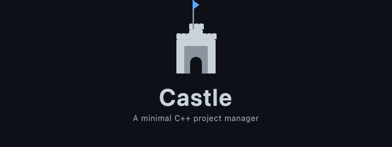

<p align="center">
  
</p>

<p align="center">
  
  
  
  
</p>

***

## Castle

A minimal, Cargo inspired C++ project manager written in Rust. Castle scaffolds, builds, and runs C++ projects with clang and C++23 by default. It is intentionally small and readable: you can understand the entire codebase in one sitting, yet it carries real substance — a manifest, build profiles, sanitizers, clangd integration, watch mode, tests, formatting, and static analysis, all behind one friendly `castle` command.

> **Origins.** This project began as [sunless2day/Castle](https://github.com/sunless2day/Castle), a ~200 line Rust learning milestone written in two days. The original `new`, `build`, and `run` commands still work exactly as they did. Everything else in this repository is additive: a demonstration of how far a minimal, well structured foundation can be extended with best practices and a little imagination. Credit and gratitude to the original author for the lovely starting point.

***

## Navigation

| Section | Content |
| --- | --- |
| [Features](#features) | All commands and flags |
| [Quick Start](#quick-start) | Install and run in 30 seconds |
| [Install](#install) | Platform specific prerequisites |
| [Manifest](#manifest) | The `castle.toml` reference |
| [Backends](#backends) | Clang direct vs. CMake |
| [Comparison](#comparison) | Castle versus other tools |
| [Roadmap](#roadmap) | Planned future work |
| [Development](#development) | Build, test, and contribute |
| [Acknowledgments](#acknowledgments) | Credits and thanks |

***

## Features

| Command | Purpose |
| --- | --- |
| `castle new <name>` | Scaffold a project in a new directory |
| `castle init [name]` | Scaffold a project in the current directory |
| `castle build` | Compile and link the project |
| `castle run [args]` | Build, then execute the binary. Supports `--watch` |
| `castle check` | Fast `-fsyntax-only` type check (no linking) |
| `castle test` | Build and run everything under `tests/` |
| `castle clean [--force]` | Remove `build/` and `compile_commands.json` |
| `castle fmt` | Run `clang-format` over `src/` and `tests/` |
| `castle tidy` | Run `clang-tidy` using the project's `compile_commands.json` |
| `castle version` | Print Castle version and detected toolchain information |
| `castle --help` | List all commands with descriptions |

Build time flags: `--release` (debug is the default when absent), `--cxx-standard=20|23|26`, `--backend clang|cmake`, `--asan` / `--tsan` / `--ubsan` / `--msan`, `--pedantic`.

***

## Quick Start

```bash
cargo install --path .
export PATH="$HOME/.cargo/bin:$PATH"

castle new hello
cd hello
castle build
castle run
```

Output: `Hello, world! Your castle stands.`

After the first `castle build`, a `compile_commands.json` appears at the project root. clangd picks it up automatically: no extra configuration needed in VS Code, Neovim, or Helix.

***

## Install

**Prerequisites**

| Requirement | Notes |
| --- | --- |
| Rust 1.87 or later | Edition 2024; uses let-chains stabilized in 1.87. `rustup install stable` |
| clang 18 or later | Used for version probing |
| clang++ on PATH | Castle compiles and links via the C++ driver so the standard library is linked automatically |

**Platform instructions**

| Platform | Command |
| --- | --- |
| macOS | `xcode-select --install` (Apple clang 21+ covers C++23) |
| Ubuntu / Debian | `sudo apt install clang-18 clang++-18` |
| Windows | `choco install llvm` or download from [llvm.org](https://llvm.org) |

**Optional tools** (detected at runtime, used when present)

| Tool | Used by |
| --- | --- |
| cmake | `castle build --backend cmake` |
| clang-format | `castle fmt` |
| clang-tidy | `castle tidy` |
| ccache | Suggested as a hint during builds |

```bash
cargo install --path .
```

***

## Manifest

Every field has a sensible default: a project with no `castle.toml` still builds. Running `castle new` or `castle init` writes a fully commented template. Here is the reference:

```toml
backend = "clang"          # "clang" (default) or "cmake"

[package]
name = "hello"             # output binary name
version = "0.1.0"          # informational
cxx_standard = 23          # 23 (default), 20, or 26

[profile]
opt_level = "0"            # "0", "1", "2", "3", or "s" (size)
debug_info = true          # emit -g in non-release builds
warnings_as_errors = false
pedantic = true            # -Wpedantic
sanitizer = "address"      # "address" | "thread" | "undefined" | "memory"
```

CLI flags override the manifest. `castle build --release --cxx-standard=26` wins over the `[profile]` and `cxx_standard` fields. The `--pedantic` flag only forces warnings on; omitting it preserves whatever the manifest specifies.

***

## Backends

Castle has two interchangeable build backends that share one flag derivation so they never drift apart.

| Backend | How it works | Best for |
| --- | --- | --- |
| `clang` (default) | Drives `clang++` directly: one `-c` per translation unit into `build/`, then a final link. Needs only clang. | Minimal setups, quick iteration |
| `cmake` (opt-in) | Generates a `CMakeLists.txt` from the manifest, then shells out to `cmake --build`. | Multi-file projects, IDE integration |

Choose per project with `backend = "cmake"` in `castle.toml`, or per invocation with `--backend cmake`. Both backends write a `compile_commands.json` to the project root.

***

## Comparison

| | Castle | CMake | Meson | Cargo (Rust) |
| --- | --- | --- | --- | --- |
| Language | C++ | C, C++, others | many | Rust |
| Manifest | `castle.toml` | `CMakeLists.txt` | `meson.build` | `Cargo.toml` |
| Single command DX | yes | no (configure then build) | yes | yes |
| Scaffolding | built in | no | built in | built in |
| clangd out of the box | yes (writes `compile_commands.json`) | with a flag | yes | n/a |
| Scope | small, opinionated | full featured | full featured | full featured |

Castle is not a replacement for CMake or Meson. It is a thin, friendly project manager that can drive CMake when you want it.

***

## Roadmap

Documented future work. See `ARCHITECTURE.md` and `CHANGELOG.md` for deeper context.

- **Dependencies.** `castle add <git-url>` vendoring with CMake `FetchContent`.
- **Libraries.** `castle new --lib`, header-only versus compiled, a `[targets]` table.
- **Templates.** `castle new --template=<name>` from a user supplied `templates/` directory.
- **Workspaces.** Multi-project `[workspace]` support.
- **C++23 modules.** A dependency scanner for `import` statements to order BMI compilation. Documented honestly as a stretch goal.
- **ccache wiring.** Route the clang backend through `ccache` automatically.
- **Shell completions and man page.** Via `clap_complete` and `clap_mangen`.

***

## Dependencies

The original Castle had zero dependencies. This expansion adds a small, justified set:

| Crate | Purpose |
| --- | --- |
| `clap` (derive) | CLI: subcommands, `--help`, flag parsing |
| `serde` + `toml` | Parse `castle.toml` with defaults and validation |
| `serde_json` | Write `compile_commands.json` for clangd |
| `thiserror` | Typed `CastleError` enum with friendly messages |
| `notify` | `castle run --watch` rebuilds on source change |
| `tempfile` (dev) | Integration tests scaffold real projects in temp directories |

No async runtime. No heavy build graph library. Castle stays a script at heart.

***

## Development

```bash
cargo fmt                              # formatting
cargo clippy --all-targets -- -D warnings   # linting
cargo test                             # unit + integration (26 tests)
cargo doc --no-deps --open             # documentation
```

See `CONTRIBUTING.md` for the module map and instructions on adding a command. See `ARCHITECTURE.md` for a control flow tour of the entire codebase.

***

## CI

| Job | Targets |
| --- | --- |
| `check` | macOS, Ubuntu, Windows: fmt, clippy, tests, live round trip |
| `cross-check` | `x86_64-pc-windows-gnu`, `x86_64-apple-darwin`, `aarch64-apple-darwin`, `aarch64-unknown-linux-gnu`: `cargo check --all-targets` |

***

## Acknowledgments

This project is a demonstration built on [sunless2day/Castle](https://github.com/sunless2day/Castle), a ~200 line C++ project manager written in Rust as a two day learning milestone. The original author's clean, readable design made this expansion possible and enjoyable. All credit for the foundation belongs to them.

***

## License

MIT. See [LICENSE](LICENSE) for the full text. This project builds on [sunless2day/Castle](https://github.com/sunless2day/Castle), which was shared as a public learning resource.
